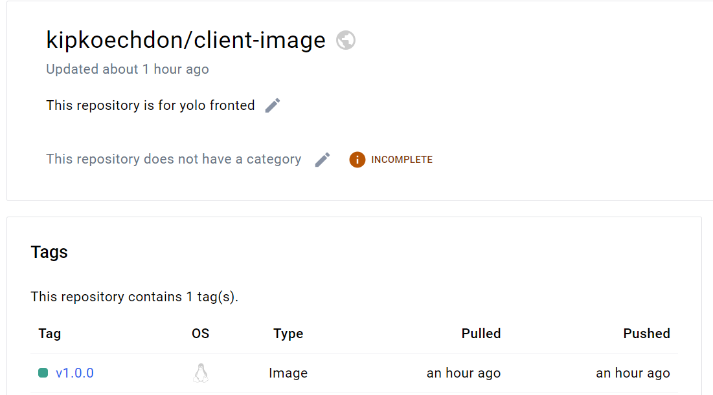

# Requirements

This Docker-compose.yaml uses two docker images fetched my docker repository.
-kipkoechdon/client-image:v1.0.0
-kipkoechdon/yolo-backend-image:v1.0.0
-mongodb for db dervice

-Image  contains the necessary dependencies and configuration for running the client-side application and backend application as well as pre-configured MongoDB instance, making it convenient for running a MongoDB database without the need for manual setup.

## Dockerfile directives

-No Dockerfile is needed for the database container (mongo image) as it's using an official image directly from Docker Hub. This image contains all the necessary configurations and setup for running a MongoDB database instance

## Docker Networks
-Docker-compose Networking (Application port allocation and a bridge network implementation)
-my-network

##
Docker-compose volume definition and usage:
A volume named 'data' is defined in the docker-compose.yml file for persisting data generated by the MongoDB database. This volume is mounted to the '/data/db' directory inside the MongoDB container, ensuring that data is retained even if the container is stopped or removed.
Additionally, the client and backend services use bind mounts (volumes) to mount the local ./client and ./backend directories to the /app directories inside the respective containers. This allows for live code reloading during development and avoids the need to rebuild the Docker images every time a change is made to the source code


## Running
- Clone the repo 
- run 'docker-compose up' to set the containers up and running.
- access the application at 'http://localhost:3000/'

## Images using semver versioning syntax





# Terraform

## Task 1: Initialize Terraform
```yaml

   terraform init
```

The shell module runs terraform init to initialize a Terraform working directory

## Task 2: Apply Terraform
```yaml
terraform plan
 terraform apply -auto-approve
  
```

### Roles on playbook.yml
 *Testing connectivity*
 *updating the server*
 *installing docker and dependencies*
 *cloning the repo*
 *running docker compose*

