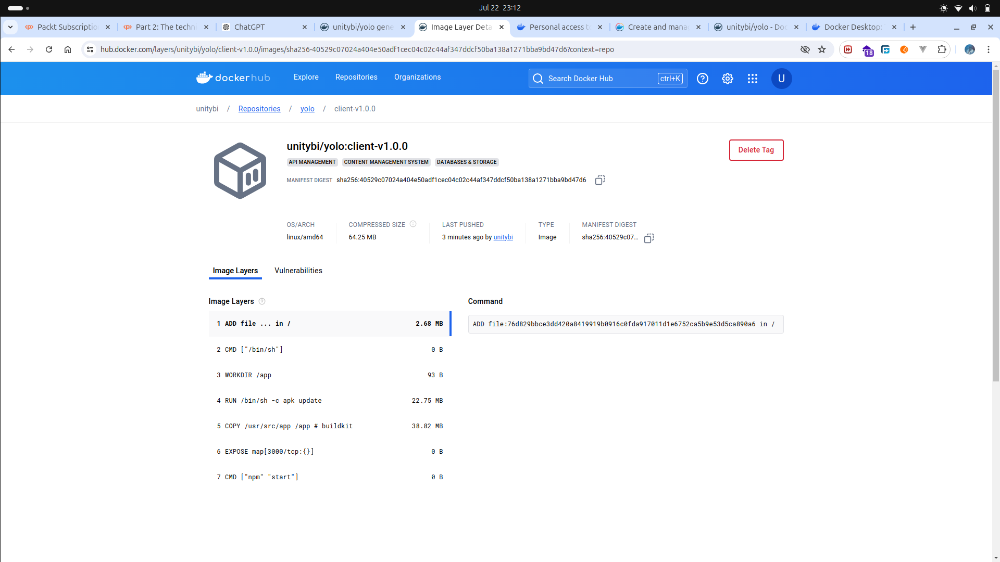
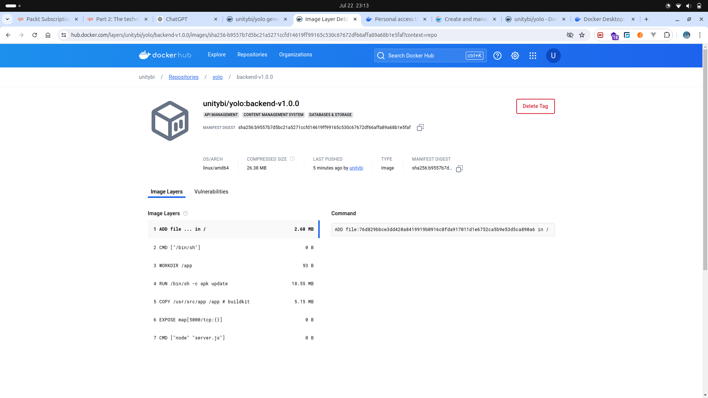
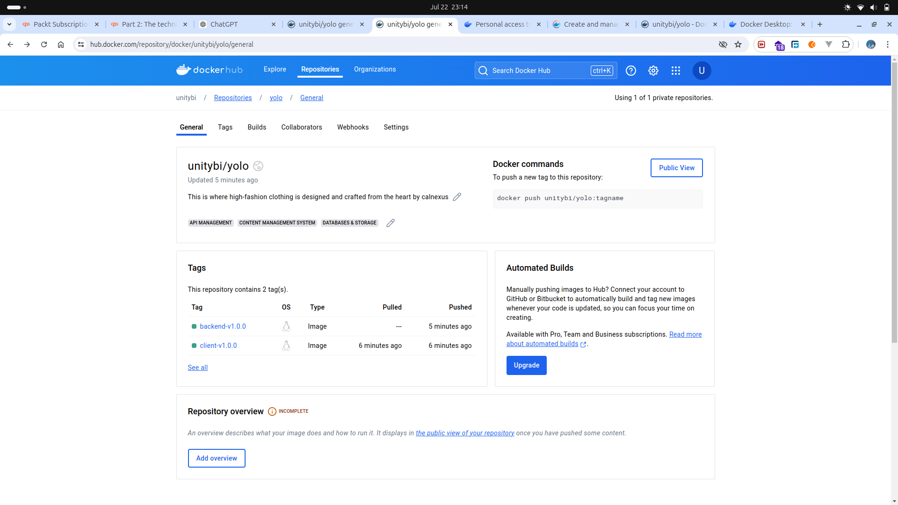

# Explanation

## Objectives

### 1. Choice of the Base Image on Which to Build Each Container

- **Frontend (Client):** The base image used is `node:14-alpine`. The Alpine version is chosen for its minimalistic and lightweight nature, reducing the image size while providing all necessary functionalities for running a React application.
- **Backend:** The base image used is `node:14-alpine`. This ensures compatibility with the backend (Express.js) and keeps the image size small.

### 2. Dockerfile Directives Used in the Creation and Running of Each Container

- **Frontend:**
  - `FROM node:14-alpine`: Sets the base image.
  - `WORKDIR /app`: Sets the working directory.
  - `COPY . .`: Copies the application code to the container.
  - `RUN npm install`: Installs dependencies.
  - `CMD ["npm", "start"]`: Runs the application.

- **Backend:**
  - `FROM node:14-alpine`: Sets the base image.
  - `WORKDIR /app`: Sets the working directory.
  - `COPY . .`: Copies the application code to the container.
  - `RUN npm install`: Installs dependencies.
  - `CMD ["node", "server.js"]`: Runs the application.

### 3. Docker-Compose Networking (Application Port Allocation and a Bridge Network Implementation)

- **Ports:**
  - Frontend: Maps port `3000` of the container to port `3000` on the host.
  - Backend: Maps port `5000` of the container to port `5000` on the host.
  - MongoDB: Maps port `27017` of the container to port `27017` on the host.
- **Network:**
  - A custom bridge network `app-net` is defined to allow containers to communicate with each other.

### 4. Docker-Compose Volume Definition and Usage

- **MongoDB Volume:**
  - A named volume `app-mongo-data` is created to persist MongoDB data, ensuring data is not lost when containers are stopped or restarted.

### 5. Git Workflow Used to Achieve the Task

- **Branching:** Feature branches are created for new functionalities or fixes.
- **Commits:** Descriptive commits are made to track progress.
- **Pull Requests:** Feature branches are merged into the main branch via pull requests after code reviews.
- **Tagging:** Version tags (e.g., `v1.0.0`) are used for Docker images to ensure version control and easy rollback if needed.

### Successful Running of the Applications and Debugging Measures Applied

- **Running:** The application can be started using `sudo docker-compose up --build`.
- **Debugging:**
  - Use `docker logs <container_id>` to check container logs for errors.
  - Use `docker exec -it <container_id> /bin/sh` to run a shell inside the container for debugging.

### Good Practices

- **Image Tagging:** Using semantic versioning (e.g., `v1.0.0`, `v1.0.1`) for image tags helps in identifying different versions easily.
- **Minimizing Image Size:** Using Alpine versions of Node.js and MongoDB images to keep the image size small and efficient.

### Screenshot of Deployed Images on Docker Hub






## Process to Build and Deploy Images

1. **Build the Images:**
   - Ensure Docker is installed and running.
   - Navigate to the project directory and run `sudo docker-compose build` to build the images locally.

2. **Run the Containers Locally:**
   - Use `sudo docker-compose up -d` to start the containers in detached mode.
   - Verify the running containers with `sudo docker ps`.

3. **Tag the Images for Docker Hub:**
   - Tag the images using:
     ```bash
     sudo docker tag calnexus-yolo-client:v1.0.0 unitybi/yolo:client-v1.0.0
     sudo docker tag calnexus-yolo-backend:v1.0.0 unitybi/yolo:backend-v1.0.0
     ```

4. **Push the Images to Docker Hub:**
   - Log in to Docker Hub using `sudo docker login`.
   - Push the images:
     ```bash
     sudo docker push unitybi/yolo:client-v1.0.0
     sudo docker push unitybi/yolo:backend-v1.0.0
     ```

By following these steps, the images were built locally, run to verify functionality, tagged appropriately, and pushed to Docker Hub for deployment.
