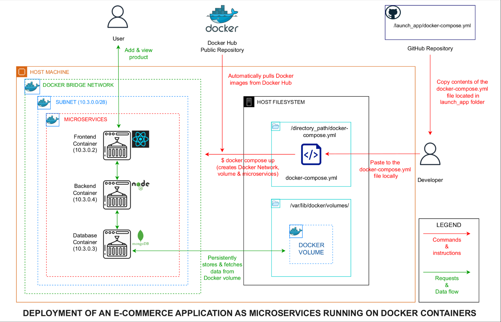
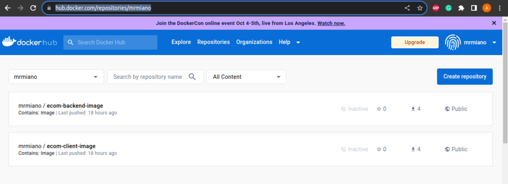

# Overview
This project involved the containerization and deployment of an e-commerce application using Docker.
Here's a visual illustration of the application architecture and how it can be deployed:

For a detailed guide on the steps taken to containerize the application, see the [PROCEDURE.md] file

# Requirements
Make sure that you have the following installed:
- [Docker](https://docs.docker.com/engine/install/) 

## How to launch the application 
### Method 1 (faster)
- NOTE: This method does not require cloning of this repository

- Navigate to the launch_app folder and copy the contents of the [docker-compose.yml](https://github.com/MrMiano-DevOps/yolo/blob/master/launch_app/docker-compose.yml) file

- On your local machine, navigate to your desired directory and create
  a docker-compose.yml file, paste the contents into it and save

  `touch docker-compose.yml`

- Launch the application using docker compose

  `docker compose up`

### Method 2
- NOTE: This method requires cloning of this entire repository

- Clone this repository to your local machine

  `git clone https://github.com/MrMiano-DevOps/yolo.git`

- Navigate to the root directory of your cloned repository

  `cd yolo`

- Launch the application using the docker compose command

  `docker compose up`

## Access the application on your browser using the following URL
 `http://localhost:3000/`

## How to stop the application
- Navigate back to your terminal and press "ctrl+c" 

## How to remove the application completely
 `docker compose down`

## The Docker images used in this application are sourced from this repository

https://hub.docker.com/repositories/mrmiano

